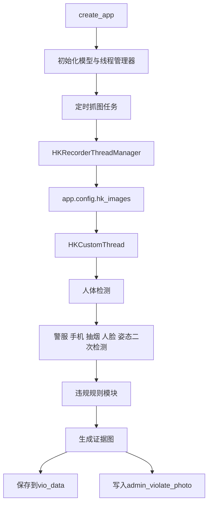
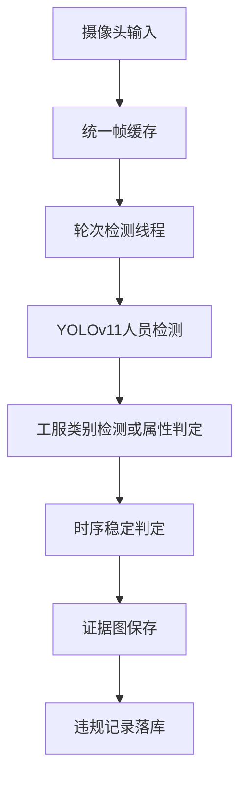

# 现有检测逻辑梳理

## 1. 文档目的

本文用于梳理当前仓库中与“未正常穿戴工服”最接近的现有检测实现，帮助后续基于 YOLOv11 重写新的加油站工服监测系统。

需要先明确一点：

- 当前代码真正实现的核心语义是“未穿警服”，不是“加油站工人未穿工服”
- 当前工程最有价值的部分，不是警服规则本身，而是整套“采集 -> 缓存 -> 轮次推理 -> 规则判定 -> 证据图保存 -> 数据落库”的检测框架

因此，这份文档既说明“现有系统怎么检测”，也说明“哪些逻辑可以迁移到 YOLOv11，哪些需要重写”。

## 2. 当前系统结论概览

### 2.1 一句话总结

当前 `inspection-flask` 的理想检测主链路是：

海康摄像头抓图 -> 将最新帧写入全局缓存 -> 检测线程按轮次读取缓存 -> 使用 YOLOv5 及二次模型做人体/警服/手机/抽烟/人脸等检测 -> 将整轮结果送入违规模块 -> 生成证据图并写入数据库。

### 2.2 当前实现与目标需求的关系

| 维度 | 当前仓库实现 | 你的目标 |
| --- | --- | --- |
| 场景 | 警务场景 | 加油站作业场景 |
| 规则名称 | 未穿警服 | 未穿工服 |
| 检测对象 | 正式民警/人员 | 加油站工人 |
| 合规服装 | `coat`、`cloth`、`shirt` | 需要重新定义为工服类别 |
| 判定前提 | 依赖 `face` | 通常不应依赖人脸 |
| 主模型框架 | YOLOv5 风格加载与推理 | 计划替换为 YOLOv11 |

## 3. 核心文件索引

### 3.1 检测主链路

- `inspection-flask/app.py`
- `inspection-flask/applications/__init__.py`
- `inspection-flask/applications/view/system/hk_camera.py`
- `inspection-flask/applications/common/hk_recorder_threading.py`
- `inspection-flask/applications/common/hk_custom_threading_plus.py`
- `inspection-flask/utils/models.py`
- `inspection-flask/violation_module/base.py`
- `inspection-flask/violation_module/vio_zsmjwcjf.py`
- `inspection-flask/settings.py`

### 3.2 相关数据模型

- `inspection-flask/applications/models/admin_hk_camera.py`
- `inspection-flask/applications/models/admin_violate_photo.py`

### 3.3 相关说明文档

- `Documents/yolo_project_audit.md`
- `Documents/workwear_rule_design.md`
- `Documents/database_initialization.md`
- `Documents/deployment_topology.md`

## 4. 现有检测主链路总览

从代码设计上看，这条链路可以拆成 5 层：

1. 应用启动与组件初始化
2. 摄像头抓图与缓存
3. 检测线程轮次调度
4. 模型推理与违规规则判定
5. 证据图保存与数据库落库

下面按这个顺序展开。

## 5. 启动入口与初始化逻辑

### 5.1 Web 入口

项目入口在 `inspection-flask/app.py`，核心只有两步：

1. 调用 `create_app()`
2. 启动 Flask 服务

真正的检测系统初始化发生在 `inspection-flask/applications/__init__.py` 的 `create_app()` 中。

### 5.2 理想设计下应该完成的初始化

`create_app()` 中原本设计了以下检测相关初始化：

- 选择推理设备 `select_device("0")`
- 通过 `get_all_models(device)` 加载人体检测、烟手机检测、警服检测、姿态估计模型
- 初始化 `Lying_Detect()` 和 `FaceRecognition()`
- 将模型对象写入 `app.config`
- 初始化海康检测线程管理器 `hk_threadManager`
- 初始化全局图像缓存 `hk_images` 和时间缓存 `hk_images_datetime`
- 初始化 `HKRecorderThreadManager`
- 用 `BackgroundScheduler` 周期性调度抓图任务
- 定时重启检测线程，避免长时间运行后线程失效

也就是说，系统设计思路不是“每次请求才检测”，而是“应用启动后持续后台取图和检测”。

### 5.3 当前源码实际状态

虽然上面的初始化逻辑都写在 `create_app()` 中，但与检测强相关的一整段代码目前被注释掉了。

这意味着要区分两种状态：

- 设计上的主链路：代码作者原本希望系统按后台持续检测的方式运行
- 当前仓库的静态源码状态：模型、线程管理器、抓图缓存、定时调度默认并没有在启动阶段真正初始化

这会带来一个重要理解点：

- 文档上可以按“设计链路”梳理系统
- 但分析当前仓库是否能直接运行时，必须额外考虑这些注释代码是否已在本地环境中被手动恢复

## 6. 摄像头采集与线程调度逻辑

### 6.1 摄像头信息来源

海康摄像头设备信息定义在 `admin_hk_camera` 表，对应模型文件是 `inspection-flask/applications/models/admin_hk_camera.py`。

主要字段包括：

- `id`
- `ip`
- `port`
- `username`
- `password`
- `enable`
- `channel`
- `channel_type`
- `type`
- `station_id`
- `dept_id`
- `sub_id`

其中 `type` 的含义是：

- `0`：正常地点
- `1`：值班室
- `2`：枪库

这个字段会直接影响后续进入哪类违规规则。

### 6.2 摄像头启停接口

`inspection-flask/applications/view/system/hk_camera.py` 提供了海康摄像头的启用和禁用接口。

其流程是：

1. `/hk_camera/enable` 把指定摄像头设置为启用
2. 从数据库取出该摄像头对象
3. 组装成 `HKCamera` 对象
4. 调用 `current_app.config['hk_threadManager'].add_thread(camera_info)` 启动检测线程

禁用流程则调用：

- `current_app.config['hk_threadManager'].stop_thread(_id)`

因此，`hk_camera.py` 在业务层面承担的是“控制某个摄像头开始或停止检测”。

### 6.3 抓图层：HKRecorderThreadManager

海康图像抓取主逻辑在 `inspection-flask/applications/common/hk_recorder_threading.py`。

它的职责不是做推理，而是周期性把海康视频流中的最新帧写入内存缓存。

具体流程如下：

1. 从 `admin_hk_camera` 中读取所有 `enable == 1` 且未删除的海康摄像头
2. 按 `ip + username + password` 分组，复用同一台海康设备连接
3. 生成 `HK_INFO`
4. 调用海康 SDK 的 `HKStream.login()` 和 `play_preview()`
5. 从 `hks.IMAGES[channel_name]` 读取每个通道当前帧
6. 将图像写入 `app.config['hk_images'][camera_id]`
7. 将抓图时间写入 `app.config['hk_images_datetime'][camera_id]`

这部分本质上是采集缓存层，核心产物有两个：

- `hk_images`：最新图像缓存
- `hk_images_datetime`：对应时间戳缓存

### 6.4 检测线程层：HKCustomThread

单个摄像头对应的检测线程位于 `inspection-flask/applications/common/hk_custom_threading_plus.py`，类名是 `HKCustomThread`。

这个线程不直接打开视频流，而是反复从全局缓存 `hk_images` 中读取属于自己摄像头 id 的图像。

也就是说：

- `HKRecorderThreadManager` 负责“取图”
- `HKCustomThread` 负责“读缓存并检测”

这是现有架构里很重要的分层。

## 7. 轮次检测机制

### 7.1 一轮检测怎么定义

在 `inspection-flask/settings.py` 中，检测轮次相关参数如下：

- `get_image_interval = 110`
- `round_interval = 0`
- `images_num = 5`
- `rest_time = 20 * 60`

含义是：

- 每隔 110 秒取一张图
- 一轮累计 5 张图
- 一轮完成后默认不额外休眠
- 如果长时间无人，则休息 20 分钟

### 7.2 detect_vio 的主循环

`HKCustomThread.detect_vio()` 是现有系统最核心的检测主循环。

它会持续执行以下步骤：

1. 检查线程状态，若已关闭则退出
2. 检查当前缓存中是否已有本摄像头最新图像
3. 取出 `app.config['hk_images'][camera.id]`
4. 把该帧追加到 `hk_camera_images`
5. 调用 `add_target(image, app)` 对当前帧做检测
6. 把当前时间追加到 `datetime_list`
7. 将 `hk_images[camera.id]` 置空，避免重复消费
8. 达到 `images_num` 后，对整轮数据做违规判定

整轮判定结束后：

- 若本轮完全没人，则按 `rest_time` 休眠
- 若检测到人，则执行常规违规项以及按场景追加的违规项
- 清空本轮缓存
- 开始下一轮

### 7.3 场景分流

整轮数据形成后，系统会先执行常规违规判断，再根据 `camera.type` 执行场景专属判断。

常规场景始终执行：

- 未穿警服
- 人员聚集
- 抽烟
- 玩手机

按场景追加：

- `type == 1`：值班室，增加脱岗、睡岗
- `type == 2`：枪库，增加非正式民警、人数不足
- `type == 0`：询问/讯问室，增加单警询问

这说明现有工程本质上是一个“多规则统一调度框架”，工服类规则只是其中一个分支。

## 8. YOLOv5 推理与二次检测逻辑

### 8.1 当前使用的模型

在 `inspection-flask/settings.py` 中，当前关键模型权重配置为：

- `YI_WEIGHT = weights/yolov5l.pt`
- `ER_WEIGHT = weights/zj_erci_230324.pt`
- `CLOTH_WEIGHT = weights/police_uniform.pt`
- `POSE_WEIGHT = weights/checkpoint_iter_370000.pth`

可见当前主检测框架是以 YOLOv5 风格接口为基础的。

### 8.2 模型加载方式

`inspection-flask/utils/models.py` 中的 `get_all_models(device)` 会加载：

- 一次人体检测模型 `model1`
- 二次烟手机检测模型 `model2`
- 警服检测模型 `model3`
- 姿态估计网络 `pose_net`

此外，`create_app()` 中原本还会加载：

- `FaceRecognition()`
- `Lying_Detect()`

所以当前系统不是单一模型，而是一个多模型协同检测流程。

### 8.3 通用推理封装

当前 YOLOv5 风格推理主要封装在两个函数中：

- `seek_target(model, device, image)`
- `seek_targets(model, device, images)`

它们做的事情包括：

1. `letterbox` 预处理
2. BGR 转 RGB
3. 调整为 BCHW 张量
4. 归一化到 `0~1`
5. 执行 `model(img, augment=True)[0]`
6. 执行 `non_max_suppression`
7. 用 `scale_coords` 将框映射回原图尺寸

最终输出统一整理为列表结构：

`[x1, y1, x2, y2, conf, cls_name]`

这套封装是后续替换为 YOLOv11 时最需要重写的部分之一。

### 8.4 单帧推理细节

`HKCustomThread.common_target()` 描述了当前单帧检测的详细顺序。

处理流程如下：

1. 先对整帧图像调用 `seek_target()` 做人体检测
2. 只对 `conf > 0.6` 且类别为 `person` 的目标继续处理
3. 对人框裁剪区域做姿态估计 `run_pose()`
4. 调用 `add_white_background()`，把人框区域保留、背景置白
5. 使用 `cloth_detect_model` 对该图做警服检测
6. 使用 `smoke_phone_detect_model` 对人框局部图做手机/抽烟检测
7. 使用 `face_detect_model.detect_faces_in_person_img()` 对人框做人脸检测
8. 把这些二次检测结果统一追加到该人的检测结果中

因此，当前“未穿警服”规则并不是直接对整图做一次工服检测，而是：

- 先做人检测
- 再对每个人做二次服装检测
- 再把这些子结果作为规则输入

## 9. 未穿警服规则的真实判定逻辑

### 9.1 规则所在位置

与工服规则最接近的当前实现位于：

- `inspection-flask/violation_module/vio_zsmjwcjf.py`

类名是 `NoClothesViolation`，但其 `name` 固定写成了：

- `未穿警服`

### 9.2 规则判定条件

其核心逻辑可以概括为：

1. 遍历整轮所有帧的所有人
2. 只处理 `person`、`fu_person`、`person_szf` 等人员标签
3. 该人员结果必须包含二次检测列表
4. 二次检测结果中必须检测到 `face`
5. 二次检测结果中不能检测到 `coat`、`cloth`、`shirt`
6. 若某人满足上面条件，则认为该帧出现“未穿警服”候选
7. 只有当整轮 `settings.images_num` 帧都命中违规时，才真正保存

也就是说，当前规则不是“某一帧未检测到工服就告警”，而是更严格的：

- 需要整轮稳定命中
- 依赖人脸存在
- 合规衣物标签固定写死

### 9.3 为什么它不能直接用于加油站工服检测

当前规则存在明显的警务场景假设：

1. 规则名称固定是“未穿警服”
2. 结果标签会被改成 `police`
3. 合规服装类别写死为 `coat`、`cloth`、`shirt`
4. 判定依赖 `face`
5. 时序策略要求一整轮全部违规

对于加油站工服检测，这些假设多数都不合适：

- 工人不一定正脸出现
- 是否穿工服不应依赖人脸
- 工服类别可能包含反光衣、工装上衣、防护服等
- 现场遮挡和姿态变化更大，不能简单沿用“整轮全命中”

## 10. 证据图生成与结果落库逻辑

### 10.1 违规基类 BaseVio

`inspection-flask/violation_module/base.py` 提供了所有违规模块共用的保存逻辑。

它的保存流程是：

1. 从 `plot_targets` 中挑选置信度最高的一帧
2. 取出该帧原图
3. 用 `plot_one_box()` 给目标画框
4. 用 `plot_txt_PIL()` 在图上写中文违规名称
5. 调用 `save_violate_photo()` 保存图像并落库

因此，违规模块本身主要负责“判定哪些帧违规”，而真正的“保存一张最终证据图”由基类统一完成。

### 10.2 图片保存位置

在 `inspection-flask/settings.py` 中：

- `VIO_IMAGE_PATH = BASE_DIR.joinpath('vio_data')`

说明证据图默认保存到：

- `inspection-flask/vio_data`

### 10.3 数据落库

具体落库逻辑在 `inspection-flask/applications/view/system/hk_camera.py` 的 `save_violate_photo()` 中。

它会执行：

1. 生成唯一文件名
2. 调用 `cv2.imwrite()` 保存图片
3. 构造访问路径 `/_uploads/photos/<filename>`
4. 写入 `ViolatePhoto` 数据
5. 提交数据库事务

对应的数据表模型在 `inspection-flask/applications/models/admin_violate_photo.py`，关键字段包括：

- `violate_id`
- `href`
- `station_id`
- `dept_id`
- `sub_id`
- `camera_id`
- `position_time`
- `review`

### 10.4 现有数据模型中的一个风险

`ViolatePhoto.camera_id` 的外键指向：

- `admin_camera.id`

但海康检测链路实际使用的是：

- `admin_hk_camera`

也就是说，当前源码层面存在一个模型语义不完全一致的问题：

- 运行时保存的 `camera_id` 来自海康摄像头
- 数据表外键却仍然绑定旧的 `admin_camera`

这类问题在后续 YOLOv11 重写时需要顺手清理，否则会影响结果表设计的一致性。

## 11. 现有实现中的关键差异与风险

### 11.1 理想链路和当前源码状态不一致

最关键的问题是：

- `create_app()` 中与检测相关的初始化代码当前被整段注释

这包括：

- 模型加载
- `hk_threadManager`
- `hk_images`
- `hk_images_datetime`
- `HKRecorderThreadManager`
- 定时抓图任务

但 `hk_camera.py` 的启用接口又依赖：

- `current_app.config['hk_threadManager']`

因此从静态代码看，当前仓库存在“调用方依赖某些全局对象，但初始化默认未启用”的矛盾。

### 11.2 当前系统更像“已设计完成、但初始化未完全接通”的工程

从模块结构看，系统设计并不混乱，主链路其实很清晰：

- 抓图层
- 缓存层
- 线程轮次调度层
- 推理层
- 规则层
- 保存层

真正的问题在于：

- 启动配置和初始化状态与业务接口并不完全一致
- 项目已经从旧 `Camera` 路径切到 `HKCamera` 路径，但部分模型关系仍带旧系统痕迹
- 文档中的“目标工服规则”与代码中的“警服规则”之间还有业务语义差距

## 12. 与“加油站工服检测”之间的差距

### 12.1 当前代码已经具备的可复用框架

如果后续你要重写 YOLOv11 版本，现有工程中最值得保留的是这些结构性能力：

1. 摄像头接入与设备管理流程
2. 海康抓图缓存机制
3. 单摄像头单线程的轮次检测框架
4. 多规则统一调度模式
5. 证据图生成与保存流程
6. 违规结果落库与页面展示链路

这些部分并不强依赖 YOLOv5，可以作为新系统的基础框架参考。

### 12.2 必须重写或重构的部分

为了适配“加油站工人未正常穿戴工服”的目标，下面这些逻辑需要重写或显著调整：

1. 模型加载与推理封装
   - 当前是 YOLOv5 风格接口
   - 后续要改成 YOLOv11 的模型加载、推理与结果解析方式

2. 业务类别定义
   - 当前服装类别是警服语义
   - 后续要重新定义工服类别，如工装上衣、反光衣、防护服等

3. 规则判定前提
   - 当前依赖人脸
   - 工服规则通常应直接根据人员框与服装检测结果判定

4. 时序稳定策略
   - 当前要求整轮全部违规
   - 新系统更适合采用连续帧阈值或比例阈值

5. 场景规则命名
   - 当前多处仍然写死“警服”“police”
   - 需要替换为与加油站业务一致的字段和告警名称

### 12.3 后续 YOLOv11 系统建议保留的总体架构

建议后续新系统保留下面这条主思路，只替换模型与业务规则：

这样做的好处是：

- 迁移成本可控
- 现有管理端和存储逻辑容易复用
- 可以把“模型升级”和“业务规则重构”拆开推进

## 13. 面向 YOLOv11 改造的理解结论

对你当前任务来说，最重要的不是继续沿用“未穿警服”规则，而是先抓住现有系统的三个核心分层：

### 13.1 可复用的骨架

- 海康摄像头接入
- 图像缓存
- 轮次调度
- 证据图保存
- 违规事件落库

### 13.2 需要替换的检测核心

- YOLOv5 模型加载与推理函数
- 警服检测模型
- 依赖人脸的业务逻辑
- 警务场景规则命名与标签

### 13.3 你后续写新系统时应遵循的原则

1. 先保留检测框架，再替换模型
2. 先把“警服规则”抽象成“工服规则”，再写代码
3. 不要把加油站工服规则继续写死为特定场景标签
4. 尽量把合规服装类别、阈值、时序策略做成可配置项

## 14. 最终结论

当前工程虽然使用的是 YOLOv5，且业务语义仍然是警务场景，但它已经提供了一套比较完整的检测系统框架：

- 有摄像头接入
- 有抓图缓存
- 有多线程轮次检测
- 有多模型协同推理
- 有违规规则模块
- 有证据图保存
- 有数据库落库

你后续的 YOLOv11 监测系统，最合理的思路不是推倒整个项目，而是：

- 复用现有系统的“工程骨架”
- 替换 YOLOv5 推理部分
- 重写“未穿警服”为“未穿工服”规则
- 让规则与类别定义更适合加油站工人场景

从这个角度看，现有项目的检测逻辑已经基本理清，后续可以进一步进入 YOLOv11 新系统的设计阶段。
