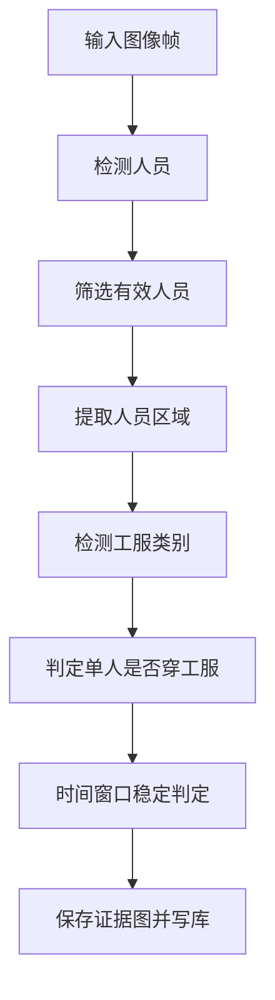

# YOLOv11 改造中的复用与重写建议

## 1. 文档目的

本文基于 `Documents/current_detection_logic.md` 的梳理结果，进一步回答两个更落地的问题：

1. 当前工程里，哪些部分可以直接照搬，哪些部分只需要细微改动
2. 哪些部分必须重点重写，才能更适合“加油站工人未正常穿戴工服”的 YOLOv11 监测系统

本文会尽量具体到文件名，并说明推荐改法。

## 2. 先给结论

如果把现有系统拆成“工程骨架”和“检测语义”两部分，那么建议如下：

### 2.1 可以优先保留的工程骨架

- 海康摄像头接入与启停接口
- 图像抓取与缓存机制
- 单摄像头单线程的轮次检测模式
- 证据图保存逻辑
- 违规结果落库与页面展示链路

### 2.2 必须替换的检测核心

- YOLOv5 模型加载与推理封装
- 当前“未穿警服”规则类
- 人脸依赖逻辑
- 警务场景标签、类别名和日志文案
- 现有“整轮全命中”时序判定策略

### 2.3 最合理的迁移方式

不建议推翻整个项目重写，建议采用下面的迁移原则：

1. 先复用采集、缓存、线程、保存、落库框架
2. 再替换 YOLOv5 为 YOLOv11 推理模块
3. 然后重写“未穿工服”规则
4. 最后再做精度优化，包括时序稳定、阈值调优、误报过滤

## 3. 哪些部分可以直接照搬

这部分指的是整体职责基本不变，代码结构也可以继续沿用，只需要很少甚至不需要改动。


| 文件                                                                                    | 是否可照搬 | 原因                          | 建议               |
| ------------------------------------------------------------------------------------- | ----- | --------------------------- | ---------------- |
| `inspection-flask/app.py`                                                             | 基本可照搬 | 只是 Flask 启动入口，不依赖 YOLOv5 细节 | 直接保留             |
| `inspection-flask/applications/common/hk_recorder_threading.py`                       | 大体可照搬 | 它负责海康抓图与写入缓存，不直接依赖 YOLOv5   | 保留主结构，只做稳定性小修    |
| `inspection-flask/applications/common/hk_custom_threading_plus.py` 中的 `ThreadManager` | 大体可照搬 | 线程的增删启停逻辑与模型版本无关            | 保留类结构，修改线程内部执行内容 |
| `inspection-flask/violation_module/base.py`                                           | 大体可照搬 | 负责选证据帧、画框、保存，不强依赖警服语义       | 保留主流程，扩展元数据      |
| `inspection-flask/applications/view/system/hk_camera.py` 中的列表、增删改查接口                  | 可照搬   | 摄像头管理接口与检测模型解耦              | 保留页面和接口结构        |


### 3.1 `inspection-flask/app.py`

这个文件基本可以原样保留。

原因：

- 只负责启动 Flask 应用
- 不包含检测业务逻辑
- 不依赖 YOLOv5 或 YOLOv11 的具体接口

建议：

- 不用动
- 如果后续服务端口、配置方式有调整，再单独处理

### 3.2 `inspection-flask/applications/common/hk_recorder_threading.py`

这个文件建议“照搬主逻辑，小修稳定性”。

当前职责：

- 查询已启用海康摄像头
- 登录海康设备
- 抓取各通道当前图像
- 写入 `app.config['hk_images']`
- 写入 `app.config['hk_images_datetime']`

为什么可以保留：

- 它是采集层，不关心你后面用的是 YOLOv5 还是 YOLOv11
- 对于新系统来说，图像采集与检测模型是两个独立问题

最合适的小改方式：

1. 保留 `HKRecorderThreadManager.run()` 的整体结构
2. 保留按 `ip + username + password` 分组的思路
3. 增加更明确的异常日志和设备重连日志
4. 在写缓存前增加空帧保护
5. 如果后续帧率更高，可以考虑给 `hk_images` 增加“只保留最新帧”的明确注释

建议重点小改位置：

- `get_img()`：增加空图、异常通道、超时重试说明
- `HKRecorderThreadManager.run()`：补齐 `repeat_channels_ip` 未初始化这类潜在问题

### 3.3 `inspection-flask/applications/common/hk_custom_threading_plus.py` 中的 `ThreadManager`

这个类建议保留。

保留的部分：

- `add_thread()`
- `stop_thread()`
- `stop_all_threads()`
- `restart_all_threads()`

原因：

- 它们本质是线程生命周期管理
- 与具体检测规则无关

最合适的小改方式：

1. 保留线程字典 `self.threads`
2. 保留一个摄像头对应一个检测线程的模式
3. 将线程创建目标继续设为“单摄像头检测线程”
4. 把线程内部执行内容从当前警务逻辑换成新的 YOLOv11 工服逻辑

### 3.4 `inspection-flask/violation_module/base.py`

这个文件建议保留主框架。

它已经做得比较合理的部分包括：

- 统一维护违规帧集合
- 选取最佳证据帧
- 统一画框
- 统一叠加中文违规名
- 统一调用保存函数

为什么适合保留：

- 这些都是“输出层”能力
- 不依赖警服业务本身

最合适的小改方式：

1. 保留 `add_plot_targets()` 和 `save()` 的主框架
2. 把日志里的警务语义清掉
3. 让 `save()` 支持更多通用字段，例如：
  - `rule_code`
  - `rule_name`
  - `extra_meta`
4. 后续如果要支持多种 PPE 违规，可以让标注文本支持动态描述

### 3.5 `inspection-flask/applications/view/system/hk_camera.py` 中的摄像头管理接口

这部分建议保留页面和接口结构。

可保留内容：

- 列表查询
- 新增摄像头
- 更新摄像头
- 删除摄像头
- 启用/禁用摄像头

原因：

- 这些是设备管理功能
- 不是 YOLOv5 绑定逻辑

最合适的小改方式：

1. 保留蓝图与 URL 结构
2. 保留启用时启动线程、禁用时停止线程的机制
3. 把日志和界面文案从警务语义改成更中性的“监控设备”“工服检测设备”

## 4. 哪些部分适合小改，不建议重写

这部分的特点是：文件本身有价值，但存在轻度业务耦合或旧设计痕迹，适合在原文件上迭代。


| 文件                                                                                 | 建议    | 说明                                 |
| ---------------------------------------------------------------------------------- | ----- | ---------------------------------- |
| `inspection-flask/applications/__init__.py`                                        | 小改    | 恢复并重构初始化逻辑                         |
| `inspection-flask/settings.py`                                                     | 小改    | 替换权重、阈值、类别配置                       |
| `inspection-flask/applications/view/system/hk_camera.py` 中的 `save_violate_photo()` | 小改    | 统一工服告警字段和日志                        |
| `inspection-flask/applications/models/admin_violate_photo.py`                      | 小改或中改 | 解决 `camera_id` 与 `HKCamera` 的一致性问题 |
| `Documents/workwear_rule_design.md`                                                | 可继续沿用 | 作为新规则设计依据                          |


### 4.1 `inspection-flask/applications/__init__.py`

这个文件不建议重写，建议“恢复初始化 + 去掉旧耦合”。

当前问题：

- 检测相关初始化代码被整段注释
- 但业务接口又依赖这些初始化产物

最合适的改法：

1. 保留 `create_app()` 结构
2. 恢复模型初始化、缓存初始化、线程管理器初始化、定时任务初始化
3. 把原来写死的 YOLOv5 初始化替换成新的 YOLOv11 初始化函数
4. 把“警服检测模型”“人脸检测模型”等按需改为新命名

推荐改造方向：

- 原来的 `get_all_models(device)` 改成更清晰的工厂函数，例如：
  - `load_detection_models(device)`
- 配置项改成通用名字，例如：
  - `person_model`
  - `workwear_model`
  - `ppe_rules`

### 4.2 `inspection-flask/settings.py`

这个文件建议小改，不建议重写。

可保留内容：

- `VIO_IMAGE_PATH`
- `get_image_interval`
- `round_interval`
- `images_num`
- `rest_time`

需要改动的部分：

- `YI_WEIGHT`
- `ER_WEIGHT`
- `CLOTH_WEIGHT`
- 与警务规则绑定的类别阈值含义

最合适的改法：

1. 把 YOLOv5 相关权重配置换成 YOLOv11 配置
2. 把 `CLOTH_WEIGHT` 改成更中性的名字，例如 `WORKWEAR_WEIGHT`
3. 把类别映射从代码硬编码迁移到配置区
4. 增加以下配置项：
  - `WORKWEAR_LABELS`
  - `WORKWEAR_CONF`
  - `MIN_PERSON_BOX_AREA`
  - `TEMPORAL_WINDOW_SIZE`
  - `TEMPORAL_TRIGGER_RATIO`

### 4.3 `inspection-flask/applications/view/system/hk_camera.py` 中的 `save_violate_photo()`

这个函数建议保留，但要做很关键的小改。

当前问题：

- 日志里写死了“未穿警服”
- 落库语义仍偏旧系统

最合适的改法：

1. 保留图片保存和数据库提交流程
2. 移除 `type == 21` 时写死“未穿警服”的日志
3. 改成按 `rule_name` 或违规类型配置输出日志
4. 后续可把函数签名扩展为：

```python
save_violate_photo(
    rule_id,
    camera_id,
    frame,
    station_id,
    dept_id,
    sub_id,
    path,
    event_time,
    rule_name=None,
    extra_meta=None,
)
```

这样后续无论是未穿工服、未戴安全帽还是未穿反光衣，都能复用。

### 4.4 `inspection-flask/applications/models/admin_violate_photo.py`

这个文件建议做小改或中改，取决于你们是否愿意调整数据库结构。

当前问题：

- `camera_id` 外键指向 `admin_camera.id`
- 但海康检测链路实际使用的是 `admin_hk_camera`

最合适的改法分两种：

1. 保守方案
  - 暂时不改表结构
  - 继续沿用 `camera_id`
  - 只把它当作“来源摄像头 id”使用
2. 更合理方案
  - 在结果表中增加 `hk_camera_id`
  - 或统一摄像头模型，避免 `admin_camera` 与 `admin_hk_camera` 并存

如果你们后续要长期维护系统，建议选第二种。

## 5. 哪些部分必须重点重写

这一部分是 YOLOv11 改造的核心，不建议继续在原有警务逻辑上打补丁。


| 文件                                                                         | 是否需要重点重写 | 原因                       |
| -------------------------------------------------------------------------- | -------- | ------------------------ |
| `inspection-flask/utils/models.py`                                         | 是        | 当前完全是 YOLOv5 风格推理封装      |
| `inspection-flask/applications/common/hk_custom_threading_plus.py` 中的检测主逻辑 | 是        | 当前流程把警务语义、人脸、姿态、二次检测写得太死 |
| `inspection-flask/violation_module/vio_zsmjwcjf.py`                        | 是        | 当前规则就是“未穿警服”，不能直接迁移      |
| `inspection-flask/applications/common/logic_judge.py` 中与警服相关逻辑             | 建议重写或弃用  | 语义和数据结构偏旧                |


### 5.1 `inspection-flask/utils/models.py`

这是最需要重点重写的文件之一。

原因：

- 当前使用 `attempt_load()`，这是典型 YOLOv5 风格
- 输入预处理、推理调用、NMS、输出结构都按当前模型写死
- 后续换成 YOLOv11 后，接口和结果组织方式通常不同

最合适的重写思路：

1. 不要直接在旧函数上硬改
2. 新建一组更通用的接口，例如：

```python
load_person_detector()
load_workwear_detector()
infer_persons()
infer_workwear()
```

1. 统一输出格式，不让上层关心底层模型来自 YOLOv5 还是 YOLOv11

推荐统一输出结构：

```python
{
    "bbox": [x1, y1, x2, y2],
    "confidence": 0.91,
    "label": "person"
}
```

或者：

```python
{
    "bbox": [x1, y1, x2, y2],
    "confidence": 0.83,
    "label": "work_clothes"
}
```

只要上层拿到的都是这种通用结构，后续再换模型也不会影响业务层。

### 5.2 `inspection-flask/applications/common/hk_custom_threading_plus.py`

这个文件建议“保留线程管理骨架，重点重写检测编排逻辑”。

当前不适合直接沿用的原因：

1. `common_target()` 里写死了：
  - 姿态估计
  - 人脸检测
  - 警服检测
  - 手机/抽烟检测
2. 当前人员目标的数据结构是通过追加列表元素的方式扩展，耦合很重
3. 规则输入结构不够通用
4. 当前流程明显是为警务场景设计的

最合适的重写方式：

1. 保留 `HKCustomThread` 作为“摄像头检测线程”
2. 把内部检测流程拆成清晰的 4 步：
  - `fetch_frame()`
  - `detect_persons()`
  - `detect_workwear_for_persons()`
  - `run_rules()`
3. 不要再用 `det.append(...)` 这种方式扩展检测结果
4. 改成字典结构或数据类结构

建议的人员目标结构：

```python
person_target = {
    "bbox": [x1, y1, x2, y2],
    "confidence": 0.87,
    "label": "person",
    "workwear_items": [
        {"label": "work_clothes", "confidence": 0.74},
        {"label": "reflective_vest", "confidence": 0.68},
    ],
    "has_workwear": True,
}
```

这样改的好处是：

- 后续规则可读性高
- 更容易加新规则
- 不再和警务场景硬耦合

### 5.3 `inspection-flask/violation_module/vio_zsmjwcjf.py`

这个文件必须重写，不建议继续修改原类。

原因非常直接：

- 类名虽然叫 `NoClothesViolation`
- 但语义实际是“未穿警服”
- 并且内部包含明显警务假设

推荐做法：

1. 新建新文件，例如：
  - `inspection-flask/violation_module/vio_workwear_missing.py`
2. 新类名建议更直白，例如：
  - `WorkwearMissingViolation`
3. 不再依赖 `face`
4. 不再写死 `coat`、`cloth`、`shirt`
5. 把规则类别改成配置驱动

推荐判定逻辑：

1. 遍历每帧中的每个有效人员
2. 检查该人员是否满足最小尺寸、清晰度或置信度条件
3. 判断其 `workwear_items` 中是否存在任一合规工服类别
4. 若没有，则记为该帧违规候选
5. 对时间窗口内的候选结果做连续帧或比例统计
6. 达阈值后触发告警并保存最优证据图

### 5.4 `inspection-flask/applications/common/logic_judge.py`

如果新系统完全转向 YOLOv11 工服逻辑，这个文件里与旧警服路径强相关的函数，建议不要继续作为主路径依赖。

原因：

- 这部分是旧 RTSP/旧数据结构思路
- 与当前海康缓存主链路不是同一套结构
- 容易造成两套规则并存，后续维护更混乱

建议：

- 如果没有新需求依赖它，可以逐步边缘化
- 新系统不要把它作为核心判定模块

## 6. 新系统应该怎么写，效果更好

这一部分不只是“能跑”，而是兼顾可维护性和识别准确度。

### 6.1 推荐总流程

建议 YOLOv11 新系统采用下面的逻辑：




### 6.2 为什么推荐“先人后工服”的两阶段方案

对你们当前项目，最推荐的是两阶段方案，而不是直接整图判“有没有工服”。

原因：

1. 加油站画面通常背景复杂
2. 工服目标往往附着在人身上，单独做整图工服检测容易漏检
3. 先找到人，再在人框内判定是否穿工服，误报更低
4. 后续如果扩展到安全帽、反光衣，也更容易复用

推荐结构：

1. 第一阶段：YOLOv11 人员检测
2. 第二阶段：对每个人框做人框内工服检测或属性判定

### 6.3 工服判定逻辑怎么写更稳

推荐不要再使用“检测到人脸且未检测到衣服”这种逻辑。

更好的逻辑是：

1. 先筛掉无效人员目标
  - 人框过小
  - 置信度过低
  - 遮挡过重
2. 对有效人员框做工服检测
3. 如果检测到任一合规工服类别，则判为合规
4. 如果连续若干帧或在窗口中达到一定比例都未检出工服，再判违规

建议合规类别配置化，例如：

- `work_clothes`
- `uniform_top`
- `reflective_vest`
- `protective_suit`

### 6.4 时序策略怎么写更适合提高准确率

当前代码采用的是：

- 整轮 `images_num` 全命中才算违规

这太硬，容易漏报，也不够灵活。

更推荐两种策略：

1. 连续帧策略
  - 连续 `3` 帧未检出工服则触发
2. 比例策略
  - 最近 `5` 帧中，`60%` 及以上未检出工服则触发

对于加油站场景，我更推荐比例策略。

原因：

- 人员走动频繁
- 遮挡和角度变化较多
- 单帧结果波动比警务场景更明显

### 6.5 如何减少误报

为了让实际效果更好，建议在规则层增加这些过滤逻辑：

1. 最小人员框面积过滤
  - 太远的人不判
2. ROI 区域过滤
  - 只在加油作业区域或站内工作区域启用
3. 遮挡过滤
  - 被油枪、车辆、立柱遮挡严重的人不立即判违规
4. 重复告警抑制
  - 同一摄像头、同一时间窗口内，不要对同一目标连续重复报
5. 低光照保护
  - 夜间图像质量过低时可提高触发门槛

### 6.6 如何减少漏报

为了避免明明没穿工服却没有报出来，建议：

1. 工服类别定义不要过窄
2. 训练数据要覆盖：
  - 白天
  - 夜间
  - 阴雨
  - 遮挡
  - 远近不同距离
  - 弯腰、蹲下、侧身等姿态
3. 二阶段工服模型尽量在人框内做检测，而不是整图做
4. 时序策略优先采用比例判定，而不是全命中判定

## 7. 推荐的文件级改造方案

如果你后续开始真正编码，建议按下面顺序推进。

### 第一阶段：先让骨架复用起来

优先处理这些文件：

- `inspection-flask/applications/__init__.py`
- `inspection-flask/applications/common/hk_recorder_threading.py`
- `inspection-flask/applications/common/hk_custom_threading_plus.py`
- `inspection-flask/settings.py`

目标：

- 先把“采集、缓存、线程、初始化”这一层整理干净

### 第二阶段：替换推理核心

重点处理：

- `inspection-flask/utils/models.py`

目标：

- 把 YOLOv5 推理封装替换成 YOLOv11 推理封装
- 给上层输出统一格式结果

### 第三阶段：重写工服规则

重点处理：

- 新建 `inspection-flask/violation_module/vio_workwear_missing.py`
- 调整 `inspection-flask/violation_module/base.py`

目标：

- 实现真正适合加油站场景的“未穿工服”规则

### 第四阶段：调整保存与数据模型

重点处理：

- `inspection-flask/applications/view/system/hk_camera.py`
- `inspection-flask/applications/models/admin_violate_photo.py`

目标：

- 让结果保存与摄像头模型语义统一

## 8. 一句话建议

当前工程里，最适合直接复用的是“摄像头接入、抓图缓存、线程调度、证据保存、结果落库”这些工程骨架；最需要重写的是“模型推理层、检测编排层、工服规则层”。

如果你想要在 YOLOv11 版本里既保留工程效率，又保证识别准确度，最稳妥的方案是：

- 保留采集和线程框架
- 改成“先人后工服”的两阶段检测
- 去掉人脸依赖
- 用比例型时序策略代替全命中策略
- 把工服类别和阈值全部做成配置项

这样最容易得到一个既能落地、又方便后续继续迭代的大创项目版本。