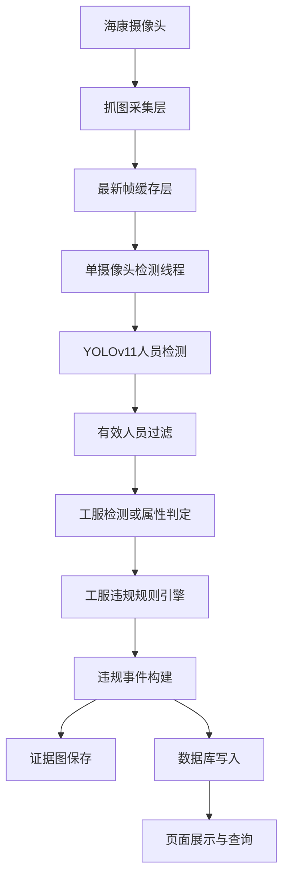
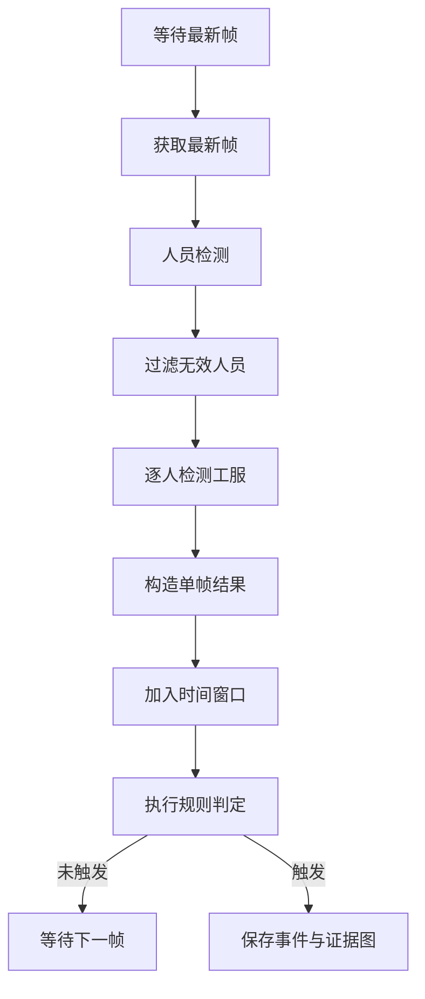

# YOLOv11 加油站工服监测系统设计文档

## 1. 文档目的

本文是在以下两份文档基础上的进一步设计：

- `Documents/current_detection_logic.md`
- `Documents/yolov11_migration_reuse_rewrite.md`

前两份文档已经回答了：

- 当前 YOLOv5 工程的检测逻辑是什么
- 哪些文件可以复用，哪些部分需要重点重写

本文继续向前一步，回答“新的 YOLOv11 监测系统应该怎么设计和怎么实现”。

目标是为后续编码提供一份可直接落地的设计说明，而不是只停留在思路层面。

## 2. 项目目标

### 2.1 业务目标

新系统需要完成的核心任务是：

- 识别加油站作业区域中的人员
- 判断人员是否按要求穿戴工服
- 对稳定时间窗口内持续未穿工服的人员触发违规告警
- 保存一张证据图并写入违规记录

### 2.2 技术目标

新系统需要满足：

- 使用 YOLOv11 作为核心检测技术
- 继续复用现有工程中可保留的采集、缓存、线程和落库框架
- 去掉当前警务场景中的强耦合逻辑
- 提高在真实加油站场景下的稳定性和准确率

## 3. 总体设计原则

### 3.1 保留工程骨架，替换检测核心

不建议推倒整个项目，而是保留现有工程中成熟的基础能力：

- 海康摄像头接入
- 图像缓存
- 检测线程调度
- 证据图保存
- 违规结果落库

重点替换这三层：

- 模型加载层
- 检测编排层
- 规则判定层

### 3.2 先人后工服

建议采用两阶段方案：

1. 先用 YOLOv11 检测人员
2. 再对每个人框做工服检测或工服属性判定

这比“整图直接判工服”更适合加油站场景，因为：

- 背景复杂
- 人员大小差异大
- 工服目标附着在人身上
- 便于后续扩展到安全帽、反光衣等 PPE

### 3.3 规则配置化

不要再把规则写死在代码里。

后续系统至少要把以下内容配置化：

- 合规工服类别
- 检测阈值
- 时序窗口大小
- 触发比例
- 最小人员尺寸
- ROI 区域
- 重复告警抑制时间

## 4. 新系统总体架构



从逻辑上看，这个新系统可以拆成 7 个模块：

1. 采集层
2. 缓存层
3. 线程调度层
4. 模型推理层
5. 规则引擎层
6. 事件输出层
7. 管理与展示层

## 5. 模块划分建议

## 5.1 采集层

### 推荐继续使用的文件

- `inspection-flask/applications/common/hk_recorder_threading.py`

### 职责

- 从海康设备抓取图像
- 按摄像头写入最新帧缓存
- 写入帧时间戳

### 建议保留的设计

- 按设备分组登录
- 每个摄像头只保留最新帧
- 与检测线程解耦

### 建议补充的能力

- 设备断连重试
- 抓图失败计数
- 空帧过滤
- 抓图耗时日志

## 5.2 缓存层

### 推荐继续使用的结构

- `app.config['hk_images']`
- `app.config['hk_images_datetime']`

### 建议

可以先不单独重写缓存模块，第一版继续沿用当前全局缓存方式即可。

如果后续并发量增加，再考虑抽象成：

- `FrameStore`
- `CameraFrameBuffer`

当前第一版只要保证这几件事：

- 每个摄像头 id 都能拿到最新帧
- 帧和时间戳一一对应
- 检测线程消费后不重复使用旧帧

## 5.3 线程调度层

### 推荐保留的文件

- `inspection-flask/applications/common/hk_custom_threading_plus.py`

### 保留内容

- `ThreadManager`
- 每摄像头一个线程
- 启停与重启机制

### 需要重写的内容

- `HKCustomThread` 内部检测流程

建议把线程内部逻辑改成更清晰的分层方法：

```python
class HKWorkwearDetectThread(threading.Thread):
    def fetch_frame(self):
        ...

    def detect_persons(self, frame):
        ...

    def build_person_contexts(self, frame, persons):
        ...

    def run_rule_engine(self, frame_batch, person_batch):
        ...

    def emit_event(self, event):
        ...
```

这样比现在把各种逻辑堆在 `detect_vio()` 和 `common_target()` 里更易维护。

## 5.4 模型推理层

### 当前建议

这层建议新写，不在旧 `utils/models.py` 上硬改。

### 推荐目标文件

- `inspection-flask/utils/models_v11.py`

或者：

- `inspection-flask/applications/common/detectors/person_detector.py`
- `inspection-flask/applications/common/detectors/workwear_detector.py`

### 推荐职责划分

#### 人员检测器

职责：

- 输入整帧图像
- 输出人员候选框

推荐接口：

```python
class PersonDetector:
    def __init__(self, weight_path, device):
        ...

    def infer(self, frame) -> list[dict]:
        ...
```

输出格式建议统一为：

```python
{
    "bbox": [x1, y1, x2, y2],
    "confidence": 0.91,
    "label": "person"
}
```

#### 工服检测器

职责：

- 输入单个人员框图像
- 输出工服相关类别

推荐接口：

```python
class WorkwearDetector:
    def __init__(self, weight_path, device):
        ...

    def infer(self, person_crop) -> list[dict]:
        ...
```

输出格式建议：

```python
{
    "bbox": [x1, y1, x2, y2],
    "confidence": 0.76,
    "label": "work_clothes"
}
```

### 推荐的第一版实现

第一版最稳妥的方式是：

- 用一个 YOLOv11 模型专门检人
- 用另一个 YOLOv11 模型专门检工服

而不是一开始就做很复杂的多任务统一模型。

原因：

- 更容易训练
- 更容易调参
- 更容易定位误报漏报原因

## 5.5 规则引擎层

### 推荐目标文件

- `inspection-flask/violation_module/vio_workwear_missing.py`

### 推荐类名

- `WorkwearMissingViolation`

### 建议拆成 4 层逻辑

#### 1. 人员筛选层

只让满足条件的人员进入规则判断。

建议过滤条件：

- 目标类别是 `person`
- 人体检测置信度高于阈值
- 人框面积高于最小阈值
- 位于目标 ROI 区域内
- 遮挡不严重

#### 2. 工服判定层

判断当前人员是否穿戴工服。

建议合规标签由配置驱动，例如：

- `work_clothes`
- `uniform_top`
- `reflective_vest`
- `protective_suit`

只要命中任一合规标签，就先判为当前帧合规。

#### 3. 时序判定层

把单帧结果转成稳定告警。

推荐优先采用比例策略：

- 最近 `5` 帧中，有 `3` 帧及以上未检出工服则触发

也可以支持连续帧策略：

- 连续 `3` 帧未检出工服则触发

#### 4. 输出层

触发后统一输出：

- 违规名称
- 摄像头 id
- 时间戳
- 违规人员框
- 证据帧
- 规则元数据

## 5.6 事件输出层

### 推荐继续使用的文件

- `inspection-flask/violation_module/base.py`
- `inspection-flask/applications/view/system/hk_camera.py` 中的 `save_violate_photo()`

### 建议修改方向

#### `base.py`

保留：

- 最优证据帧选择
- 打框
- 中文标注
- 调用保存函数

增强：

- 支持 `rule_name`
- 支持 `rule_code`
- 支持 `extra_meta`

#### `save_violate_photo()`

保留：

- 文件名生成
- 图片落盘
- 数据库提交

改造：

- 去掉写死的“未穿警服”日志
- 按规则名动态记录日志
- 为后续多种 PPE 违规预留通用字段

## 5.7 管理与展示层

### 推荐继续使用的文件

- `inspection-flask/applications/view/system/hk_camera.py`
- 现有违规图片展示页
- 现有统计查询页

### 第一版建议

第一版先不大改页面，只要做到：

- 摄像头仍能启停
- 违规结果仍能查询
- 图片仍能查看

这样你们可以把更多时间放在检测准确率上，而不是前端改造上。

## 6. 推荐的数据结构

## 6.1 人员上下文

建议不要继续使用旧逻辑里“列表追加元素”的方式。

推荐统一成字典结构：

```python
person_context = {
    "bbox": [x1, y1, x2, y2],
    "confidence": 0.88,
    "label": "person",
    "area": 24500,
    "in_roi": True,
    "workwear_items": [
        {"label": "work_clothes", "confidence": 0.74},
        {"label": "reflective_vest", "confidence": 0.62},
    ],
    "has_workwear": True,
}
```

## 6.2 单帧检测结果

```python
frame_result = {
    "camera_id": 12,
    "timestamp": "2026-03-21T10:30:00",
    "frame": frame,
    "persons": [person_context_1, person_context_2],
}
```

## 6.3 违规事件结构

```python
violation_event = {
    "rule_code": "workwear_missing",
    "rule_name": "未穿工服",
    "camera_id": 12,
    "station_id": 3,
    "dept_id": 5,
    "sub_id": 2,
    "timestamp": "2026-03-21T10:30:00",
    "frame_index": 4,
    "person_bbox": [x1, y1, x2, y2],
    "evidence_frame": frame,
    "extra_meta": {
        "window_size": 5,
        "trigger_ratio": 0.6
    }
}
```

这样后续扩展到“未戴安全帽”“未穿反光衣”时，也不需要重构整条链路。

## 7. 推荐的文件级落地方案

## 7.1 第一版尽量少改的文件

- `inspection-flask/app.py`
- `inspection-flask/applications/common/hk_recorder_threading.py`
- `inspection-flask/violation_module/base.py`
- `inspection-flask/applications/view/system/hk_camera.py` 中的设备管理接口

## 7.2 第一版必须改造的文件

- `inspection-flask/applications/__init__.py`
- `inspection-flask/settings.py`
- `inspection-flask/applications/common/hk_custom_threading_plus.py`
- `inspection-flask/utils/models.py` 或新建 `inspection-flask/utils/models_v11.py`
- 新建 `inspection-flask/violation_module/vio_workwear_missing.py`

## 7.3 建议新增的文件

- `inspection-flask/utils/models_v11.py`
- `inspection-flask/violation_module/vio_workwear_missing.py`
- `inspection-flask/applications/common/configs/ppe_rules.py`

如果你们想把结构做得更清楚，也可以新增：

- `inspection-flask/applications/common/detectors/person_detector.py`
- `inspection-flask/applications/common/detectors/workwear_detector.py`
- `inspection-flask/applications/common/rules/workwear_rule_engine.py`

## 8. 初始化设计建议

在 `applications/__init__.py` 中，建议把初始化逻辑整理成下面形式：

```python
def init_detection_components(app):
    device = select_runtime_device()
    person_model = load_person_detector(device)
    workwear_model = load_workwear_detector(device)

    app.config["device"] = device
    app.config["person_model"] = person_model
    app.config["workwear_model"] = workwear_model
    app.config["hk_threadManager"] = ThreadManager()
    app.config["hk_images"] = {}
    app.config["hk_images_datetime"] = {}
    app.config["hk_recorder_thread_manager"] = HKRecorderThreadManager()
```

然后由 `create_app()` 调用它。

这样做的好处：

- 初始化职责单独集中
- 模型版本切换更清晰
- 便于后续测试

## 9. 检测主流程建议

推荐新的单摄像头检测线程按下面流程执行：



## 10. 准确率优化设计

这部分是新系统最关键的设计点。

## 10.1 人员检测层优化

建议：

- 保证训练数据中包含加油站真实场景
- 包括白天、夜间、雨天、逆光、遮挡、远距离目标
- 人员检测阈值第一版可从 `0.55` 起调
- 对过小人体框直接过滤

目的：

- 先减少无效人框，降低后续工服误报

## 10.2 工服检测层优化

建议：

- 工服模型训练数据尽量覆盖不同颜色、角度、季节和姿态
- 不要只采集正面样本
- 加入侧身、背身、弯腰、蹲下等情况
- 工服类别不要过窄

推荐第一版工服类别：

- `work_clothes`
- `reflective_vest`
- `uniform_top`

如果业务后续需要，再细分：

- 长袖工服
- 短袖工服
- 防护外套

## 10.3 规则层优化

建议增加以下过滤逻辑：

1. ROI 过滤
   - 只对作业区目标触发检测

2. 人框面积过滤
   - 太远的人不判

3. 遮挡过滤
   - 被油枪、车辆、立柱遮挡严重时不立刻判违规

4. 告警抑制
   - 同一摄像头短时间内对同一目标不要反复报警

5. 图像质量保护
   - 极暗、过曝、模糊帧提高阈值或跳过

## 10.4 时序层优化

推荐默认参数：

| 参数 | 推荐值 | 说明 |
| --- | --- | --- |
| 人体检测阈值 | `0.55` | 第一版起点 |
| 工服检测阈值 | `0.45` | 第一版起点 |
| 窗口大小 | `5` | 与当前工程接近 |
| 触发比例 | `0.6` | 稳定优于全命中 |
| 连续触发帧数 | `3` | 可作为备选策略 |
| 最小人框面积 | 按现场调试 | 过滤远距离误报 |

加油站场景下，优先建议：

- 比例策略作为主策略
- 连续帧策略作为补充或回退

## 11. 第一版开发顺序

如果你们开始正式编码，建议按下面顺序推进。

### 阶段 1：跑通骨架

目标：

- 初始化恢复
- 抓图正常
- 线程正常
- 缓存正常

对应文件：

- `inspection-flask/applications/__init__.py`
- `inspection-flask/applications/common/hk_recorder_threading.py`
- `inspection-flask/applications/common/hk_custom_threading_plus.py`

### 阶段 2：接入 YOLOv11 推理

目标：

- 能稳定检测到人
- 能对人框做工服检测

对应文件：

- `inspection-flask/utils/models_v11.py`
- `inspection-flask/settings.py`

### 阶段 3：写工服规则

目标：

- 能根据时间窗口稳定触发“未穿工服”告警

对应文件：

- `inspection-flask/violation_module/vio_workwear_missing.py`
- `inspection-flask/violation_module/base.py`

### 阶段 4：联调保存与展示

目标：

- 证据图可保存
- 数据可查
- 页面可看

对应文件：

- `inspection-flask/applications/view/system/hk_camera.py`
- `inspection-flask/applications/models/admin_violate_photo.py`

### 阶段 5：回放调参与精度优化

目标：

- 降低误报
- 降低漏报
- 形成可展示的大创版本

这一阶段最重要的不是继续加功能，而是拿真实视频回放去调：

- 置信度阈值
- 最小目标面积
- ROI 区域
- 窗口大小
- 触发比例

## 12. 第一版最推荐的实现路线

如果只考虑“大创项目可落地、风险低、效果稳”，最推荐的路线是：

1. 保留现有海康采集和线程框架
2. 新建 YOLOv11 人员检测器
3. 新建 YOLOv11 工服检测器
4. 新建 `WorkwearMissingViolation`
5. 用比例型时间窗口替代全命中策略
6. 先只实现“未穿工服”这一条规则
7. 等第一条规则稳定后，再扩展到安全帽、反光衣等 PPE

## 13. 最终结论

新的 YOLOv11 系统，不应该再沿用当前“警服 + 人脸 + 全轮命中”的业务逻辑，而应该基于现有工程骨架，重建一套更适合加油站工服场景的检测链路：

- 采集层继续复用
- 缓存层继续复用
- 线程层部分复用
- 推理层重写
- 规则层重写
- 输出层保留并通用化

最适合你们当前项目的方案，不是最复杂的方案，而是最稳妥、最容易调试和最容易解释给老师看的方案：

- 先人后工服
- 阈值可配置
- 比例策略稳定触发
- 证据图和数据库链路完整

这样既能体现你们有完整系统设计，也更容易在比赛和验收场景中展示效果。
